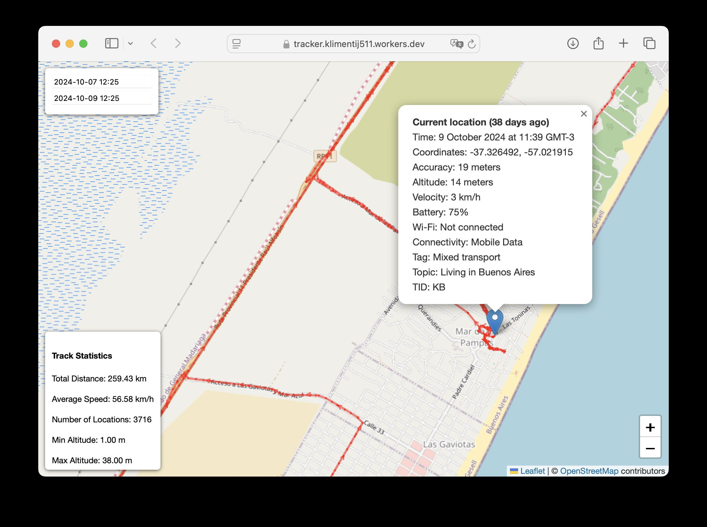

# 🌍 NerdTracker

[](https://opensource.org/licenses/MIT)
[](http://makeapullrequest.com)
[](https://github.com/yourusername/nerdtracker/releases)

> Smartphone + free services = real-time tracking & location history for active people. Privacy-focused, you own your data!

## 📑 Table of Contents
- [🌍 NerdTracker](#-nerdtracker)
  - [📑 Table of Contents](#-table-of-contents)
  - [📱 What's This?](#-whats-this)
    - [🎯 Who Is This For?](#-who-is-this-for)
    - [💡 Why I Created This](#-why-i-created-this)
    - [🌟 Key Benefits](#-key-benefits)
  - [🌟 Overview](#-overview)
    - [✨ Key Features](#-key-features)
  - [🛠️ Prerequisites](#️-prerequisites)
    - [🔧 Development Environment Setup](#-development-environment-setup)
  - [🚀 Setup Instructions](#-setup-instructions)
    - [1. Project Setup](#1-project-setup)
    - [2. Supabase Configuration](#2-supabase-configuration)
    - [3. Application Configuration](#3-application-configuration)
    - [4. Deploy Services](#4-deploy-services)
    - [5. Configure OwnTracks](#5-configure-owntracks)
    - [🔒 Security Notes](#-security-notes)
    - [Location Inserter Configuration](#location-inserter-configuration)
  - [🆓 Free Tier Limits \& Scaling Considerations](#-free-tier-limits--scaling-considerations)
    - [Current Free Tier Limits (as of Nov 2024)](#current-free-tier-limits-as-of-nov-2024)
      - [Supabase Free Tier (View current limits)](#supabase-free-tier-view-current-limits)
      - [Cloudflare Workers Free Tier (View current limits)](#cloudflare-workers-free-tier-view-current-limits)
      - [Real-World Usage Example](#real-world-usage-example)
    - [📈 Scaling Considerations](#-scaling-considerations)
  - [🤝 Contributing](#-contributing)
  - [📜 Credits](#-credits)

## 📱 What's This?

NerdTracker was born from real-world needs during extensive overland travel throughout the Americas. As a digital nomad driving from Alaska to Ushuaia and exploring South America multiple times, I needed a better way to:
- Track new vs. previously driven roads
- Remember and return to favorite spots
- Share real-time location with trusted contacts during remote travel
- Maintain a comprehensive database of my movements for analysis

Unlike temporary location sharing in messaging apps, it continuously records your movements and provides both real-time location and detailed movement history.



### 🎯 Who Is This For?

- **Overlanders & Adventurers** exploring remote areas who need reliable tracking and safety features
- **Digital Nomads** wanting to maintain detailed travel logs and avoid repeated routes
- **Remote Travelers** needing to share location with trusted contacts for safety
- **Privacy-Conscious Users** who want full control over their location data
- **Data Enthusiasts** interested in analyzing their movement patterns

### 💡 Why I Created This

After years of overland travel, I faced several challenges:
- **Safety in Remote Areas**: Needed a way for trusted contacts to check my last known location, speed, and connected WiFi networks in case of emergencies
- **Route Planning**: Existing solutions made it difficult to identify truly new routes vs. previously traveled paths
- **Data Ownership**: Manual uploading of KML/GPX files to Google My Maps was time-consuming and limiting
- **Offline Capability**: Required a system that could queue location updates during spotty signal
- **Privacy & Control**: Wanted full ownership of location data in a queryable database format
- **Cost**: Needed a free, sustainable solution for continuous tracking

### 🌟 Key Benefits

- **Safety First** - Share a URL with trusted contacts for emergency location monitoring
- **Comprehensive Data** - Track locations, speeds, WiFi connections, and more
- **Offline Ready** - Queues updates during poor connectivity
- **Zero Cost** - Built entirely on free tiers of Supabase and Cloudflare
- **True Privacy** - Your data stays in your own database
- **Data Analysis Ready** - SQL-queryable database for custom analysis

## 🌟 Overview

NerdTracker is an open-source solution for digital nomads and location tracking enthusiasts who want complete control over their movement data. Built with privacy in mind, it leverages free-tier services to create a powerful, cost-effective tracking system.

### ✨ Key Features

- 📱 24/7 iPhone location tracking via OwnTracks
- 🗄️ Personal data ownership with Supabase storage
- 🎯 Real-time location sharing with friends
- 📊 Detailed tracking data (altitude, WiFi, speed)
- 🏷️ Trip tagging and categorization
- ⚙️ Customizable tracking parameters
- 💨 Fast, serverless architecture
- 💰 Completely free to run
- 🔄 Smart Stationary Mode
  - Automatically detects when you're stationary
  - Prevents database clutter by updating existing records
  - Configurable distance threshold (default: 100m)
  - Considers the last N locations (default: 10)

## 🛠️ Prerequisites

1. 📱 **Mobile Device**
   - iPhone or Android with [OwnTracks](https://owntracks.org/) installed
   - Primary testing done on iPhone 11, but Android is supported

2. ☁️ **Required Accounts**
   - [Cloudflare Account](https://cloudflare.com) (Free tier)
   - [Supabase Account](https://supabase.com) (Free tier)

### 🔧 Development Environment Setup

> Note: This setup guide is written and tested for macOS but can be adapted for Linux or Windows systems.

1. Install nvm (Node Version Manager):
   ```bash
   curl -o- https://raw.githubusercontent.com/nvm-sh/nvm/v0.40.0/install.sh | bash
   ```
   
   **If curl command fails or nvm not found:**
   ```bash
   # Install via Homebrew
   brew install node
   ```

2. Install Node.js:
   ```bash
   # If using nvm (restart terminal first):
   nvm install 23

   # If installed via Homebrew, skip this step
   ```

3. Verify installations:
   ```bash
   node -v
   npm -v
   ```

4. Install Wrangler CLI:
   ```bash
   npm install -g wrangler
   ```

5. Authenticate with Cloudflare:
   ```bash
   wrangler login
   ```

## 🚀 Setup Instructions

### 1. Project Setup
1. Clone this repository
2. Install dependencies from the root directory:
   ```bash
   npm install --prefix location-inserter
   npm install --prefix app
   ```

### 2. Supabase Configuration
1. Create a new Supabase project:
   - Go to [supabase.com/dashboard/projects](https://supabase.com/dashboard/projects)
   - Click "New Project"
   - Note down:
     - Project URL
     - `anon` public key (Settings -> API)

2. Create database table:
   - Go to SQL editor in Supabase dashboard
   - Execute the following SQL:
   ```sql
   -- Create the table
   create table if not exists locations (
     id serial primary key,  -- Unique identifier for each entry
     "lat" float8,           -- Latitude of the location
     "lon" float8,           -- Longitude of the location
     "acc" int,              -- Accuracy of the reported location in meters
     "alt" int,              -- Altitude above sea level in meters
     "vel" int,              -- Velocity in km/h
     "vac" int,              -- Vertical accuracy of the altitude in meters
     "p" float8,             -- Barometric pressure in kPa
     "cog" int,              -- Course over ground in degrees
     "rad" int,              -- Radius around the region in meters
     "tst" int8,             -- UNIX epoch timestamp of the location fix
     "created_at" int8,      -- Timestamp when the message is constructed
     "tag" varchar,          -- Custom tag
     "topic" varchar,        -- MQTT topic
     "_type" varchar,        -- Type of the payload
     "tid" varchar(2),       -- Tracker ID used to display the initials of a user
     "conn" varchar,         -- Internet connectivity status
     "batt" int,             -- Device battery level in percent
     "bs" int,               -- Battery status (0=unknown, 1=unplugged, 2=charging, 3=full)
     "w" boolean,            -- Indicates if the phone is connected to WiFi
     "o" boolean,            -- Indicates if the phone is offline
     "m" int,                -- Monitoring mode (1=significant, 2=move)
     "ssid" varchar,         -- SSID of the WiFi
     "bssid" varchar,        -- BSSID of the WiFi
     "inregions" text[],     -- List of regions the device is currently in
     "inrids" text[],        -- List of region IDs the device is currently in
     "desc" varchar,         -- Description (used for waypoints and transitions)
     "uuid" varchar,         -- UUID of the BLE Beacon
     "major" int,            -- Major number of the BLE Beacon
     "minor" int,            -- Minor number of the BLE Beacon
     "event" varchar,        -- Event that triggered the transition
     "wtst" int8,            -- Timestamp of waypoint creation
     "poi" varchar,          -- Point of interest name
     "r" varchar,            -- Response to a reportLocation cmd message
     "u" varchar,            -- Manual publish requested by the user
     "t" varchar,            -- Trigger for the location report
     "c" varchar,            -- Circular region enter/leave event
     "b" varchar,            -- Beacon region enter/leave event
     "face" text,            -- Base64 encoded PNG image for user icon
     "steps" int,            -- Steps walked with the device
     "from_epoch" int8,      -- Effective start of time period for steps
     "to_epoch" int8,        -- Effective end of time period for steps
     "data" text,            -- Encrypted and Base64 encoded original JSON message
     "request" varchar       -- Request type (e.g., "tour")
   );

   -- Enable RLS
   alter table locations enable row level security;

   -- Drop existing policy if it exists
   drop policy if exists "Enable insert access for all users" on "public"."locations";

   -- Create policy for anonymous users to insert
   create policy "Enable insert access for all users"
   on "public"."locations"
   for insert
   to anon
   with check (true);
   ```
   - Click "Run" to execute the SQL commands

### 3. Application Configuration
1. Run the setup script:
   ```bash
   python3 setup.py
   ```
   - Enter your Supabase project URL and anon key when prompted
   - Save the generated passwords securely

### 4. Deploy Services
1. Deploy location ingestion service from root directory:
   ```bash
   npx wrangler secret bulk location-inserter/secrets.json --name location-inserter
   npm run deploy --prefix location-inserter
   ```
   Note the deployed URL (e.g., `https://location-inserter.your-name.workers.dev`)

2. Deploy web interface from root directory:
   ```bash
   npx wrangler secret bulk app/secrets.json --name tracker
   npm run deploy --prefix app
   ```

### 5. Configure OwnTracks
1. Install and open OwnTracks app on your phone
2. Go to Settings (click ⓘ icon)
3. Configure the following settings:
   - **TrackerID**: Your initials (e.g., "KS")
   - **DeviceID**: Descriptive device name (e.g., "Klim's iPhone")
   - **UserID**: Use "AUTH_USER" from location-inserter/secrets.json
   - **Password**: Use "AUTH_PASS" from location-inserter/secrets.json
   - **URL**: Your location-inserter URL (from deployment step)
   
4. Optional Settings:
   - **pubTopicBase**: Current trip name (will be added to every location)

5. Recommended GPS Settings (for high-accuracy permanent tracking):
   ```
   Mode: Move
   ignoreInaccurateLocations: 50
   locatorDisplacement: 80
   locatorInterval: 30
   positions: 10
   maxHistory: 0
   monitoring: -1
   downgrade: 0
   extended data: True
   ```

For more details on location tracking parameters, see the [OwnTracks Documentation](https://owntracks.org/booklet/features/location/).

### 🔒 Security Notes
- Store all passwords from setup.py output securely
- All endpoints use HTTPS encryption
- Authentication is required for all access
- Location data is stored only in your Supabase database

### Location Inserter Configuration

The location inserter includes a smart "hangout" detection algorithm to prevent database clutter when you're staying in one place. Here's how it works:

- When a new location is received, it checks the last 10 locations
- If all these locations are within 100 meters of each other, it considers you're "hanging out" in the same spot
- Instead of creating new entries, it updates the most recent location record
- This helps prevent thousands of nearly identical records when you're stationary

Default values (defined in `location-inserter/src/index.ts`):

```typescript
HANGOUT_SILENCE_DIST = 100    // Maximum distance (meters) between locations to be considered a hangout
LAST_LOCATIONS_COUNT = 10     // Number of recent locations to check
```

To modify these values:
1. Update the constants in `location-inserter/src/index.ts`
2. Redeploy the worker with `npm run deploy --prefix location-inserter`

This feature is particularly useful for:
- Reducing database size and costs
- Cleaner location history
- Better performance in the web interface

## 🆓 Free Tier Limits & Scaling Considerations

### Current Free Tier Limits (as of Nov 2024)

#### Supabase Free Tier ([View current limits](https://supabase.com/pricing))
- 50,000 monthly active users
- 500 MB database space
- 5 GB bandwidth
- 1 GB file storage
- Projects paused after 1 week of inactivity
- Limited to 2 active projects

#### Cloudflare Workers Free Tier ([View current limits](https://developers.cloudflare.com/workers/platform/pricing/))
- 100,000 requests per day
- 10ms CPU time per invocation
- No charge for duration

#### Real-World Usage Example
With the recommended settings (30-second location updates):
- ~2,000-3,000 location-inserter function requests per day
- ~4.24 MB of new location data per month (based on actual usage data while being mostly based in a single city with occasional trips)
  - Full-time traveling with daily movement would consume significantly more data
  - At current usage rates, the 500 MB free tier limit would support ~9.45 years of tracking
  - Each location record uses approximately 0.5 KB of storage

This means the free tier limits comfortably support personal tracking needs, with Cloudflare using only ~2-3% of its daily request limit.

### 📈 Scaling Considerations

As your tracking data grows, you may need to:

1. **Manage Database Size**:
   - Export and archive older records
   - Delete unnecessary location points
   - Consider implementing data retention policies

2. **Optimize Costs**:
   - Reduce Cloudflare Workers usage by adjusting tracking frequency
   - Implement more aggressive stationary detection
   - Clean up duplicate or unnecessary location points

3. **Upgrade Options**:
   - If you need more storage/bandwidth, consider Supabase Pro ($25/month)
   - For high-frequency tracking, consider Cloudflare Workers Paid ($5/month)
   - Cost-benefit analysis vs. data management effort

> 💡 **Tip**: For hobby projects, managing data size through exports/cleanup is often more cost-effective than upgrading tiers.

## 🤝 Contributing

Contributions are what make the open source community amazing! Any contributions you make are **greatly appreciated**.

1. Fork the Project
2. Create your Feature Branch (`git checkout -b feature/AmazingFeature`)
3. Commit your Changes (`git commit -m 'Add some AmazingFeature'`)
4. Push to the Branch (`git push origin feature/AmazingFeature`)
5. Open a Pull Request

## 📜 Credits

This project wouldn't be possible without these amazing open source projects:

- [OwnTracks iOS](https://github.com/owntracks/ios) - The incredible iOS app that powers location tracking
  - License: [MIT](https://github.com/owntracks/ios/blob/master/LICENSE)
  - Copyright (c) 2015-2023 OwnTracks

---

⭐️ If this project helped you, don't forget to give it a star!